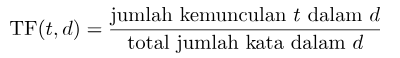
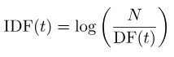
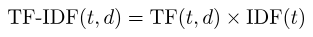
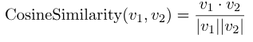
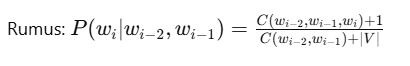

# Project Akhir UAS NLP
71220840 - 71220841 - 71220965

## Sumber Data
---------------
Seluruh artikel yang digunakan dalam proyek ini diperoleh dari sumber-sumber berikut:
- Artikel 1 : [rendy1.txt source](https://aws.amazon.com/id/what-is/artificial-intelligence/)
- Artikel 2 : [rendy2.txt source](https://theconversation.com/pentingnya-tata-kelola-data-kesehatan-di-era-ai-indonesia-harus-segera-bangun-layanan-kesehatan-terintegrasi-239383)
- Artikel 3 : [rendy3.txt source](https://ppg.dikdasmen.go.id/news/peranan-kecerdasan-buatan-artificial-intelligence-dalam-pendidikan)
- Artikel 4 : [rendy4.txt source](https://diskominfo.mukomukokab.go.id/artikel/teknologi-ai-bagaimana-kecerdasan-buatan-mengubah-industri-di-seluruh-dunia)
- Artikel 5 : [rendy5.txt source](https://www.djkn.kemenkeu.go.id/kanwil-jakarta/baca-artikel/16291/Artificial-Intelligence-AI-Pembantu-Pekerjaan-Manusia.html)
- Artikel 6 : [yosua1.txt source](https://www.kompasiana.com/lianafitri7184/67e87e54c925c44b563744f2/dinamika-ekonomi-perilaku-di-tengah-transformasi-digital)
- Artikel 7 : [yosua2.txt source](https://www.liputan6.com/bisnis/read/5981341/harga-emas-antam-ubs-dan-galeri24-pegadaian-jelang-lebaran-intip-daftarnya)
- Artikel 8 : [yosua3.txt source](https://money.kompas.com/read/2025/03/30/123249126/tol-japek-ii-selatan-dibuka-gratis-mulai-2-april-tapi-bus-dan-truk-dilarang)
- Artikel 9 : [yosua4.txt source](https://www.tempo.co/ekonomi/kisruh-izin-impor-bawang-putih-diprediksi-rugikan-masyarakat-rp-3-85-triliun-per-tahun-1225320)
- Artikel 10: [yosua5.txt source](https://money.kompas.com/read/2025/03/30/112000826/puncak-arus-balik-diprediksi-pada-6-maret-2025-begini-persiapan-jasa-marga)
- Artikel 11: [sanjaya1.txt source](https://itk.ac.id/rangkaian-kegiatan-dies-natalis-6-institut-teknologi-kalimantan/berita/sinergi-pemerintah-dan-pendidikan-tinggi-untuk-kemajuan-bangsa-di-istana-merdeka)
- Artikel 12: [sanjaya2.txt source](https://indonesia.go.id/kategori/sosial-budaya/9121/pemerintah-luncurkan-tunas-kebijakan-baru-lindungi-anak-di-dunia-digital?lang=1)
- Artikel 13: [sanjaya3.txt source](https://indonesia.go.id/kategori/sosial-budaya/9121/pemerintah-luncurkan-tunas-kebijakan-baru-lindungi-anak-di-dunia-digital?lang=1)
- Artikel 14: [sanjaya4.txt source](https://indonesia.go.id/kategori/sosial-budaya/9121/pemerintah-luncurkan-tunas-kebijakan-baru-lindungi-anak-di-dunia-digital?lang=1)
- Artikel 15: [sanjaya5.txt source](https://indonesia.go.id/kategori/sosial-budaya/9121/pemerintah-luncurkan-tunas-kebijakan-baru-lindungi-anak-di-dunia-digital?lang=1)
- Artikel 16: [ukdw1.txt source](https://ukdw.ac.id/tracer-study-alumni-gathering-chapter-bandung-jakarta-pererat-silaturahmi-tingkatkan-kompetensi/)
- Artikel 17: [ukdw2.txt source](https://ukdw.ac.id/ukdw-dan-walailak-university-satukan-visi-menuju-kolaborasi-akademik-unggul/)
- Artikel 18: [ukdw3.txt source](https://ukdw.ac.id/dosen-fti-ukdw-kembangkan-sistem-essay-scoring-berbasis-kemiripan-teks/)
- Artikel 19: [ukdw4.txt source](https://ukdw.ac.id/ukdw-dan-lembaga-alkitab-indonesia-teken-kerja-sama-bidang-penerjemahan-pendidikan-dan-pelayanan-digitalukdw-dan-lembaga-alkitab-indonesia-teken-kerja-sama-bidang-penerjemahan-pukdw-dan-lai-teken/)
- Artikel 20: [ukdw5.txt source](https://ukdw.ac.id/ukdw-dan-pppk-petra-bersinergi-memperkuat-pendidikan-kristen-di-indonesia/)

## Rumus yang Digunakan

1. **N-Gram**

   * Unigram: Token tunggal
   * Bigram: Kombinasi dua token berurutan
   * Trigram: Kombinasi tiga token berurutan

2. **Perhitungan TF-IDF:**
   - Setiap dokumen direpresentasikan sebagai sekumpulan token beserta frekuensi kemunculannya.
   - **TF (Term Frequency):**\
     Rumus:\
     

     Yang di mana *t* adalah token dan *d* adalah dokumen.
     
   - **IDF (Inverse Document Frequency):**\
     Rumus:\
     

     Yang di mana *N* adalah jumlah total dokumen, dan DF(t) adalah jumlah dokumen yang mengandung token.
     
   - **TF-IDF:**\
     Rumus:\
     

3. **Pencarian Dokumen:**
   - **Cosine Similarity:**  
     Digunakan untuk mengukur kesamaan antara vektor TF-IDF dokumen dengan vektor query.\
     Rumus:\
     

     Yang di mana:
       - v₁ • v₂ adalah dot product dari vektor v₁ dan v₂.
       - ||v₁|| dan ||v₂|| adalah norma (magnitudo) dari masing-masing vektor.

4. **Laplace Smoothing** (untuk prediksi token berikutnya dalam n-gram)

   * Rumus:\
     

## Langkah Pengerjaan

1. **Pramuat Model dan Stopwords**

   * Load stopword Bahasa Indonesia dari NLTK
   * Load stemmer dari Sastrawi

2. **Inisialisasi dan Preprocessing Dokumen**

   * Membaca dokumen .txt dari folder `uploads`
   * Membersihkan dan memproses teks menjadi token yang relevan

3. **Perhitungan & Pembobotan**

   * Hitung frekuensi unigram, bigram, trigram
   * Hitung TF dan DF untuk seluruh dokumen
   * Hitung TF-IDF setiap dokumen dan simpan sebagai vektor

4. **Visualisasi Data**

   * WordCloud berdasarkan frekuensi unigram
   * Grafik batang top 10 token terbanyak

5. **Query Processing**

   * Query pengguna diproses seperti dokumen
   * Dihitung vector TF-IDF query dan dibandingkan ke seluruh dokumen menggunakan cosine similarity
   * Menyediakan saran token berikutnya berdasarkan trigram/bigram

6. **Ekspor dan Impor State**

   * Menyimpan state corpus (dokumen, frekuensi, vektor TF-IDF) dalam file pickle untuk efisiensi
   * Saat dijalankan kembali, state dapat dimuat ulang dari file pickle
